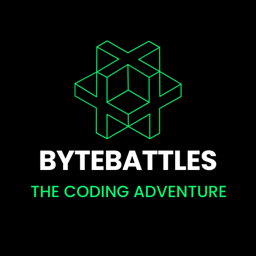

  
    
  <h2>ByteBattles Coding Adventure</h2>

Welcome to ByteBattles, the exciting coding adventure that combines competitive coding challenges with a learning journey through the world of programming!

## Introduction

ByteBattles is a unique platform designed to make learning to code fun and challenging. Dive into a world where coding meets adventure, and enhance your programming skills through engaging challenges and a captivating journey.

## Features

- **Interactive Coding Challenges:** Battle with AI opponents and test your coding skills.
- **Chapter-Based Learning:** Explore different programming topics through interactive chapters.
- **Real-Time Code Feedback:** Receive tips and suggestions from an AI mentor as you code.
