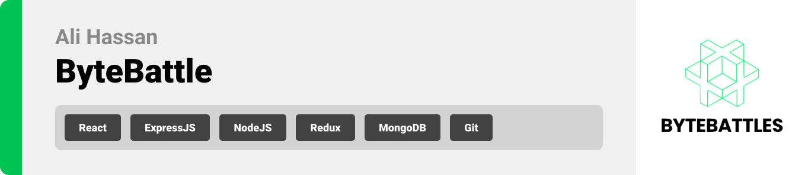

<br><br>

<!-- project philosophy -->
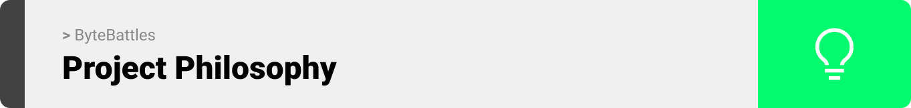

> ByteBattle is an innovative web platform that merges learning and gaming with real-world career opportunities. It's designed to make programming education engaging and directly relevant to the tech industry. Our mission is to transform how programming is learned, making it both enjoyable and practical.
>
> The platform not only offers interactive games for learning programming concepts but also features tests created by tech companies for potential hiring. This unique approach allows users to not just learn and apply coding skills, but also to connect with employers, making ByteBattle a bridge between education and employment in the tech industry.

### User Stories

#### For the User

- As a user, I want to play educational games with level progression, so I can engagingly learn programming concepts at my own pace.
- As a user, I want to take part in coding challenges so that I can test and improve my coding skills.
- As a user, I want to compete against AI in coding battles, so I can gauge my skill level and get feedback.
- As a user, I want to view detailed test results with visual feedback, so I can understand my performance on MCQ questions and programming solutions.
- As a user, I want to see my progress through courses and games, so I can track my learning journey.

#### For the Company

- As a company, I want to create and post coding tests with MCQ and programming questions, so I can assess and potentially hire skilled programmers.
- As a company, I want to view test results with detailed analytics, so I can evaluate candidate performance on individual questions and test cases.
- As a company, I want to view the leaderboard, so I can identify top-performing candidates.
- As a company, I want to customize tests for specific programming roles, so I can effectively screen candidates for job-specific skills.
- As a company, I want to see which test takers completed my tests, so I can review their submissions and scores.

<!-- Tech stack -->
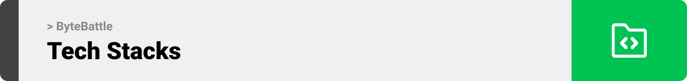

ByteBattle is built using a variety of powerful technologies:

### Frontend

- **[React](https://reactjs.org/)**: A JavaScript library for building user interfaces.
- **[Redux](https://redux.js.org/)**: A predictable state container for JavaScript apps.

### Backend

- **[.NET 8](https://dotnet.microsoft.com/)**: A modern, cross-platform framework for building web applications and APIs.
- **[ASP.NET Core](https://learn.microsoft.com/en-us/aspnet/core/)**: A high-performance web framework for building modern cloud-based applications.
- **[Entity Framework Core](https://learn.microsoft.com/en-us/ef/core/)**: A modern object-database mapper for .NET that supports LINQ queries, change tracking, updates, and schema migrations.

### Game Development

- **[Phaser Library](https://phaser.io/)**: A fast, free, and fun open source framework for Canvas and WebGL powered browser games.

### Database

- **[SQL Server](https://www.microsoft.com/en-us/sql-server)**: A relational database management system for production deployments.
- **[SQLite](https://www.sqlite.org/)**: A lightweight, file-based database for local development and testing.
- **[Entity Framework Core](https://learn.microsoft.com/en-us/ef/core/)**: Provides seamless database access with support for migrations and LINQ queries.

### Additional Libraries and Tools

- **[FontAwesome](https://fontawesome.com/)**: Comprehensive icon library for React applications.
- **[Monaco Editor](https://microsoft.github.io/monaco-editor/)**: A powerful code editor component (powers VS Code) integrated for programming challenges.
- **[GSAP](https://greensock.com/gsap/)**: Professional-grade animation library for smooth UI transitions.
- **[Phaser 3](https://phaser.io/)**: Advanced game framework for creating interactive educational games with level progression and enhanced gameplay mechanics.
- Various other React and Redux dependencies for enhanced functionality and user experience.

<br><br>

<!-- UI UX -->
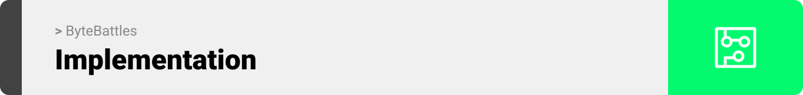

> ByteBattle is designed for streamlined navigation and engaging user experience, balancing educational games and test-taking within a cohesive interface.

- Project design details and mockups can be accessed here: [ByteBattle Design](https://www.figma.com/file/Mdc8gQ2xi0AxRRoH5NYAw0/ByteBattles?type=design&mode=design&t=8vw1uRceK4v53QHN-1)

### Mockups

| Dashboard Screen                            | Register Screen                           |
| ------------------------------------------- | ----------------------------------------- |
| 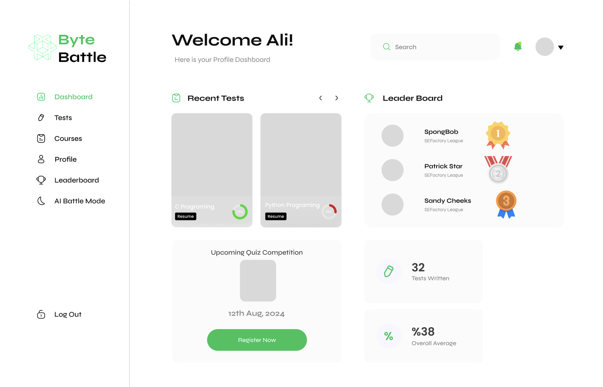 | 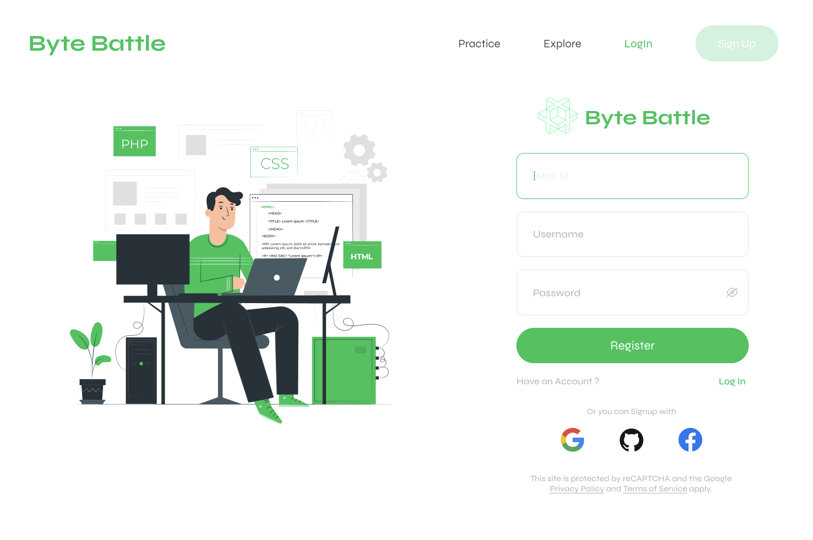 |

<br><br>

<!-- Database Design -->
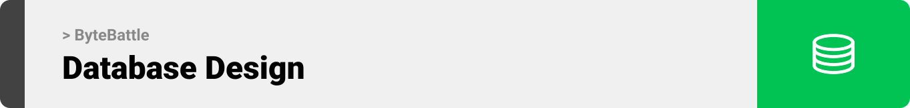

The database schema is structured using Entity Framework Core to support user data, educational content, game data, and test results. The system uses SQL Server for production and SQLite for local development, providing flexibility and ease of setup.

**Key Features:**
- Relational database design with proper foreign key relationships
- Entity Framework Core migrations for schema management
- Support for both SQL Server and SQLite databases
- Optimized queries with LINQ for efficient data access

<br><br>

| Database Schema Design                                    |
| ---------------------------------------------------------- |
| 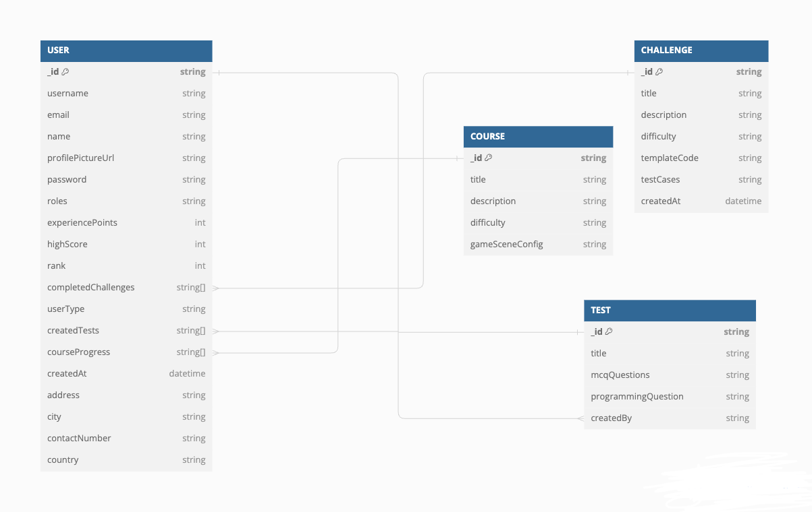 |

<br><br>

<!-- Implementation -->
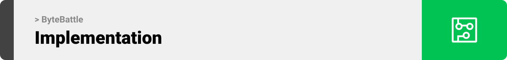

### User Interface (Web)

https://github.com/Ali-H-Hassan/ByteBattles-CodingAdventure/assets/64877225/b4b522d1-81db-4cc9-bdd0-f8b6fd7a9df4


| AI Battle                                          | Course Selection                                    |
| -------------------------------------------------- | --------------------------------------------------- |
| 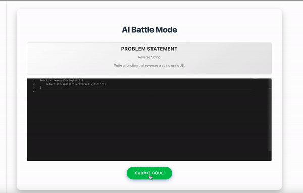                | 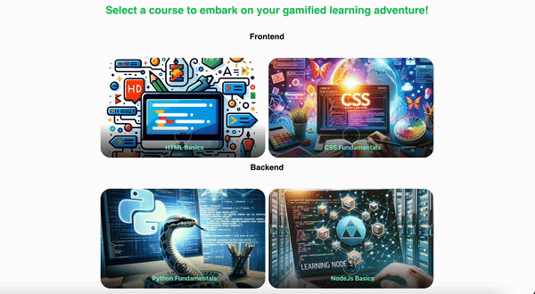     |
| Backend Game Screen                                | Frontend Game Screen                                |
|     |    |
| Google Register                                    | Company Dashboard                                   |
| 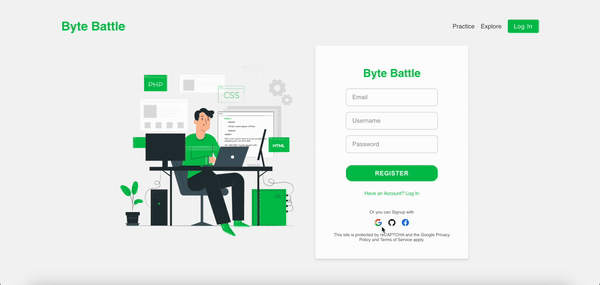    | 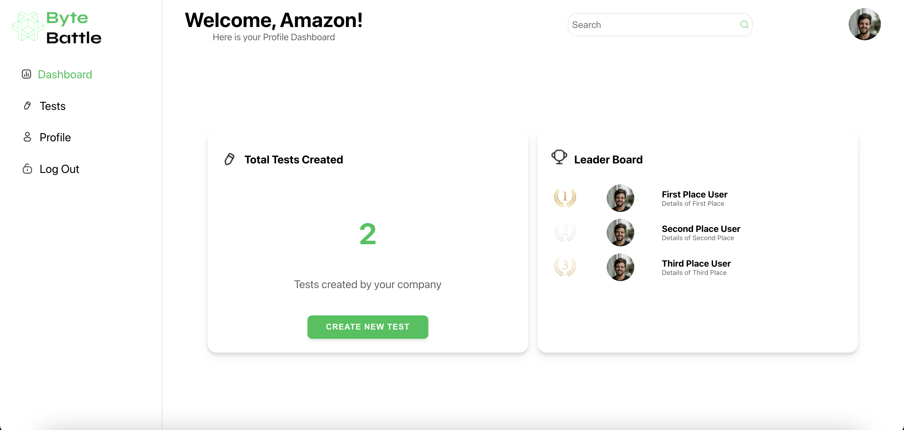 |
| Test Landing Page                                  | User Dashboard                                      |
| 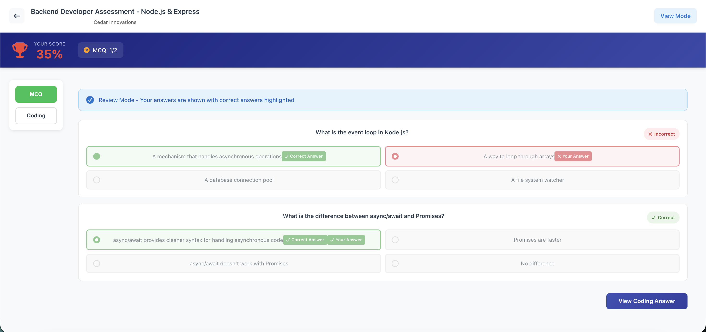 | 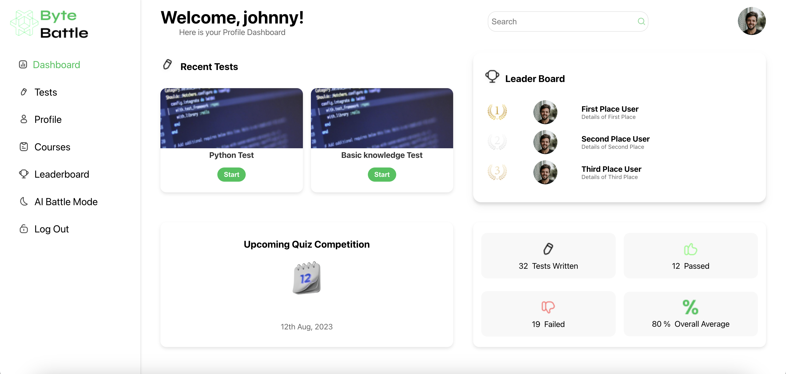      |
| Thank You Page                                     | Test Creation                                       |
| 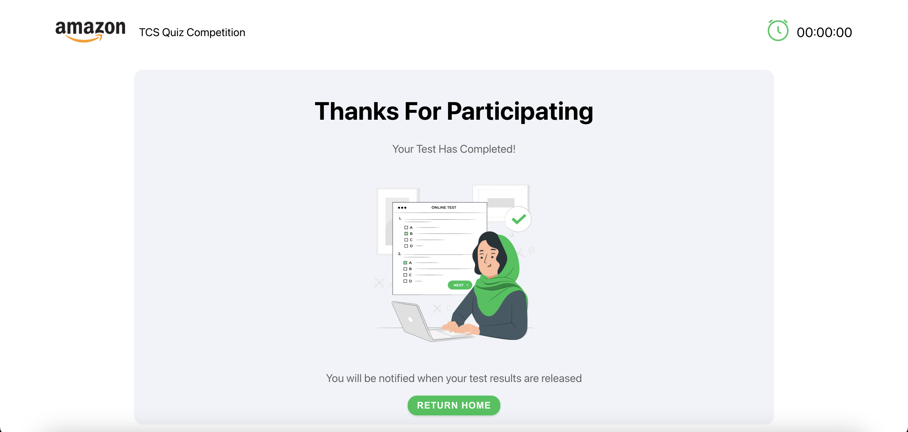       | 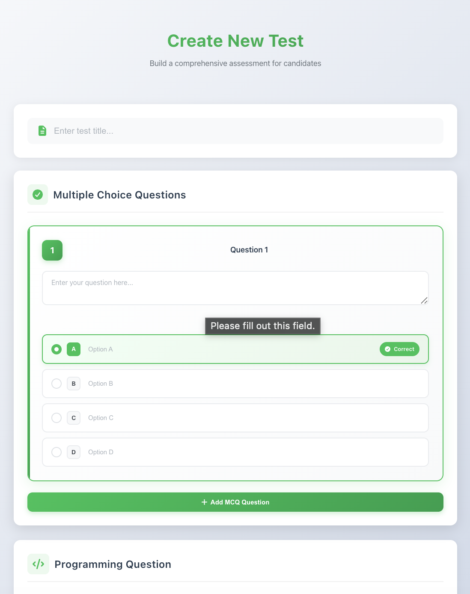           |

<br><br>

<!-- Prompt Engineering -->
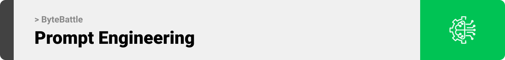

## AI-Powered Coding Duels

ByteBattle introduces an interactive AI that users can challenge in coding duels. This feature not only benchmarks user code against AI solutions but also provides personalized feedback to improve coding skills.

### Features:

- **AI Solutions**: Utilizes the Gemini AI model for generating code solutions and natural language analysis.
- **Performance Comparison**: Times user and AI code execution to foster efficient coding practices.
- **Feedback System**: Offers automated feedback on user code, highlighting areas for optimization.

### Recent Enhancements:

- **Redesigned Educational Games**: All course games (HTML, CSS, Node.js, Python) have been completely redesigned with:
  - Modern UI with level progression systems
  - Enhanced gameplay mechanics and visual feedback
  - Multiple difficulty levels (5 levels per game)
  - Score tracking with time bonuses and level bonuses
  - Interactive animations and success effects

- **Enhanced Test Results Display**:
  - Visual feedback for MCQ answers (green for correct, red for incorrect)
  - Detailed programming solution evaluation showing actual vs expected output
  - Side-by-side display of input, expected output, and actual output
  - Pass/fail indicators for each test case
  - Improved overall status messages for test results

- **Improved User Experience**:
  - Streamlined header design with balanced height
  - Enhanced profile management without default profile pictures
  - Better color contrast for score displays
  - Responsive design improvements across all pages

### Implementation:

The backend, built on .NET 8, securely executes code and evaluates performance. The AI's feedback is generated through advanced natural language processing using Google's Gemini AI model, assisting users in enhancing their coding prowess. The system provides real-time code execution results and detailed performance comparisons.

| Google Gemini AI                           |
| ------------------------------------------ |
| 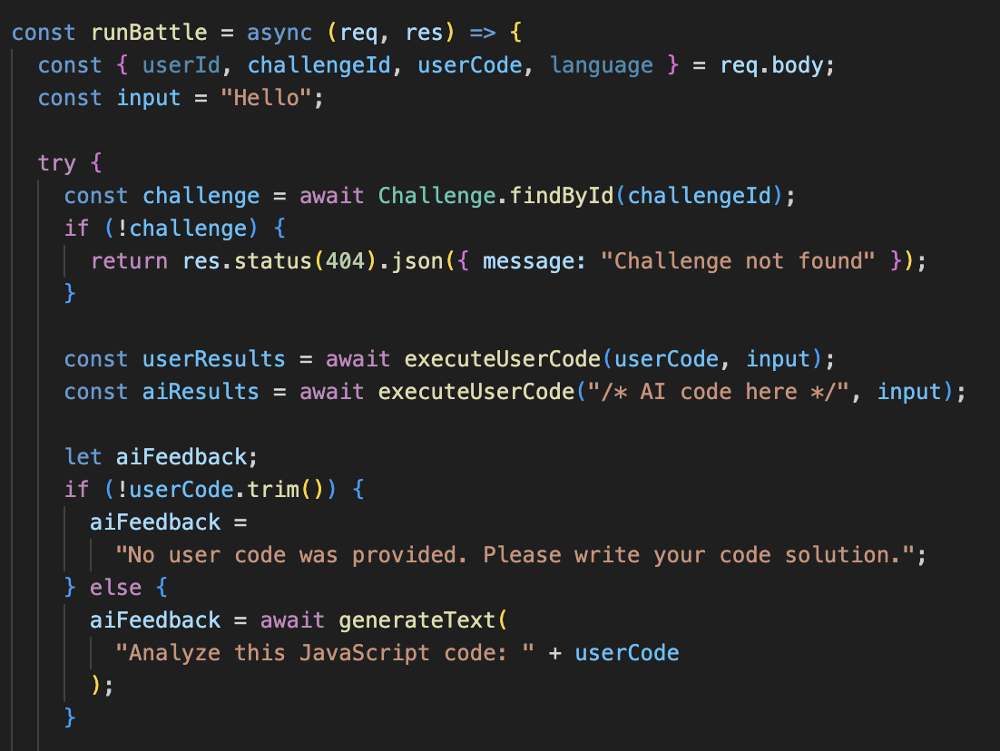 |

<br><br>

<!-- AWS Deployment -->
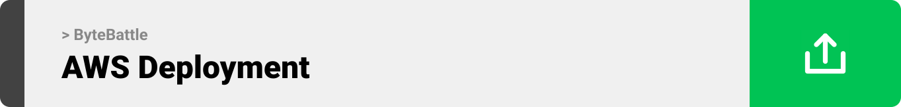

This section provides a step-by-step guide to get ByteBattle up and running on an Amazon EC2 instance.

#### Pre-requisites:

Ensure you have an EC2 instance running and you have the private key (`.pem` file) for SSH access.

#### Steps:

1. **Connecting to Your EC2 Instance:**

   ```sh
   ssh -i /path/to/my-key.pem ec2-user@my-ec2-ip-address
   ```

2. **Installing .NET 8 SDK on EC2:**

   - Update the package repository:
     ```sh
     sudo yum update -y
     ```
   - Install .NET 8 SDK:
     ```sh
     sudo yum install -y dotnet-sdk-8.0
     ```

3. **Setting Up SQL Server:**

   - Install SQL Server (or use Azure SQL Database):
     ```sh
     # For SQL Server on Linux, follow Microsoft's installation guide
     # Or configure connection to Azure SQL Database
     ```

4. **Install Git and Node.js:**

   - Install Git:
     ```sh
     sudo yum install -y git
     ```
   - Install Node.js (for frontend):
     ```sh
     sudo yum install -y nodejs
     ```

5. **Cloning the Repository and Installing Dependencies:**

   - Clone the repo and navigate to the project directory:
     ```sh
     git clone https://github.com/your_username/ByteBattles-CodingAdventure.git
     cd ByteBattles-CodingAdventure
     ```
   - Install frontend dependencies:
     ```sh
     cd frontend
     npm install
     cd ..
     ```
   - Restore .NET packages:
     ```sh
     cd ByteBattles.Server/src/ByteBattles.API
     dotnet restore
     ```

6. **Setting Up Database Connection:**

   - Update the connection string in `appsettings.json`:
     ```json
     {
       "ConnectionStrings": {
         "DefaultConnection": "Server=your-sql-server;Database=ByteBattlesDb;User Id=your-user;Password=your-password;"
       }
     }
     ```
   - Run database migrations:
     ```sh
     dotnet ef database update --project ../ByteBattles.Infrastructure
     ```

7. **Starting the Application:**
   - Start the .NET backend:
     ```sh
     cd ByteBattles.Server/src/ByteBattles.API
     dotnet run
     ```
   - In a separate terminal, start the frontend:
     ```sh
     cd frontend
     npm start
     ```

Replace `/path/to/my-key.pem`, `ec2-user@my-ec2-ip-address`, and `your_username/ByteBattles-CodingAdventure.git` with your specific details. Update the SQL Server connection string in `appsettings.json` with your actual database credentials.

<br><br>

<!-- Unit Testing -->
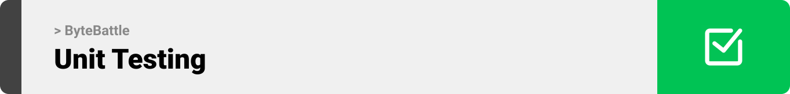

### Precision in Development: Harnessing the Power of Unit Testing:

- This project employs rigorous unit testing methodologies to ensure the reliability and accuracy of code components. By systematically evaluating individual units of the software, we guarantee a robust foundation, identifying and addressing potential issues early in the development process.

| Features testing                              |
| --------------------------------------------- |
| 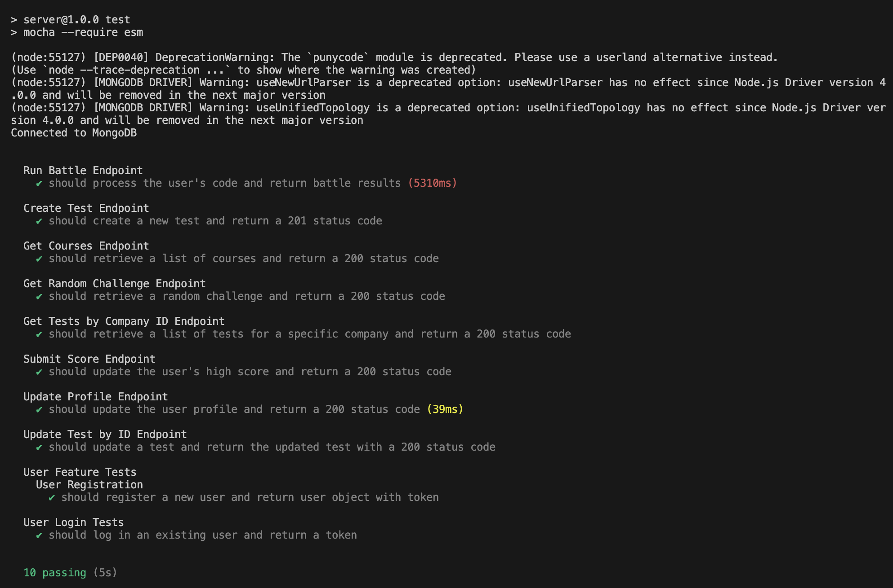 |

<br><br>

<!-- How to run -->
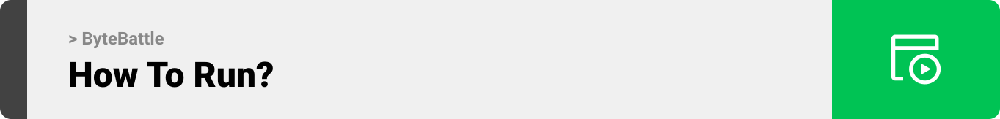

### Installation

1. **Clone the repository:**
   ```sh
   git clone https://github.com/Ali-H-Hassan/ByteBattles-CodingAdventure.git
   cd ByteBattles-CodingAdventure
   ```

2. **Install Frontend Dependencies:**
   ```sh
   cd frontend
   npm install
   ```

3. **Install .NET 8 SDK:**
   - Download and install from [.NET 8 SDK](https://dotnet.microsoft.com/download/dotnet/8.0)
   - Verify installation:
     ```sh
     dotnet --version
     ```

4. **Set Up Backend:**
   ```sh
   cd ByteBattles.Server/src/ByteBattles.API
   dotnet restore
   ```
   - For local development, SQLite is used by default (no additional setup needed)
   - For production, update `appsettings.json` with your SQL Server connection string

5. **Run Database Migrations (if needed):**
   ```sh
   dotnet ef database update --project ../ByteBattles.Infrastructure
   ```

6. **Start the Backend Server:**
   ```sh
   dotnet run
   ```
   The API will be available at `http://localhost:5057`

7. **Start the Frontend (in a new terminal):**
   ```sh
   cd frontend
   npm start
   ```
   The application will open at `http://localhost:3000`

### Configuration

- **Backend API URL**: Create a `.env` file in the `frontend/` directory:
  ```
  REACT_APP_API_URL=http://localhost:5057
  ```
  If not set, it defaults to `http://localhost:5057`

- **Database**: The application uses SQLite by default for local development. To use SQL Server, update the connection string in `ByteBattles.Server/src/ByteBattles.API/appsettings.json`

Now, you should be able to run ByteBattle locally and explore its features!
