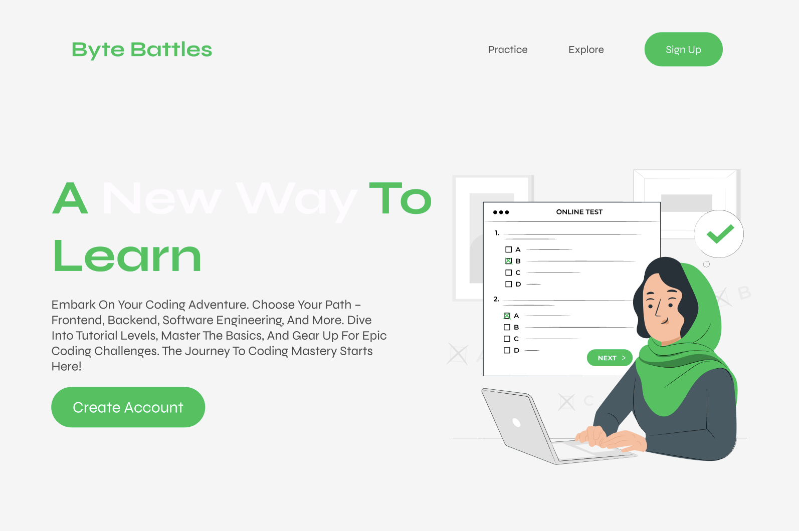

<br><br>

<!-- project philosophy -->


> ByteBattle is an innovative web platform that merges learning and gaming with real-world career opportunities. It's designed to make programming education engaging and directly relevant to the tech industry. Our mission is to transform how programming is learned, making it both enjoyable and practical.
>
> The platform not only offers interactive games for learning programming concepts but also features tests created by tech companies for potential hiring. This unique approach allows users to not just learn and apply coding skills, but also to connect with employers, making ByteBattle a bridge between education and employment in the tech industry.

### User Stories

#### For the Learner:

- As a learner, I want to play educational games, so I can engagingly learn programming concepts.
- As a learner, I want to take part in coding challenges so that I can test and improve my coding skills.
- As a learner, I want to compete against AI in coding battles, so I can gauge my skill level and get feedback.

#### For the Company:

- As a company, I want to create and post coding tests, so I can assess and potentially hire skilled programmers.
- As a company, I want to view the leaderboard, so I can identify top-performing candidates.
- As a company, I want to customize tests for specific programming roles, so I can effectively screen candidates for job-specific skills.

<!-- Tech stack -->


ByteBattle is built using the following technologies:

- The frontend is developed with [React](https://reactjs.org/) and [Redux](https://redux.js.org/), providing a robust and responsive user interface.
- Backend services are powered by [Node.js](https://nodejs.org/) and [ExpressJS](https://expressjs.com/), ensuring efficient server-side operations.
- For game development, the [Phaser Library](https://phaser.io/) is used, enabling interactive and dynamic game experiences within the platform.
- The application uses [MongoDB](https://www.mongodb.com/) for database management, offering scalable and flexible data storage.
- Additional libraries and tools like [multer](https://www.npmjs.com/package/multer) for file uploads and various React and Redux dependencies enhance the functionality and user experience.

<br><br>

<!-- UI UX -->


> ByteBattle is designed for streamlined navigation and engaging user experience, balancing educational games and test-taking within a cohesive interface.

- Project design details and mockups can be accessed here: [ByteBattle Design](https://www.figma.com/file/Mdc8gQ2xi0AxRRoH5NYAw0/ByteBattles?type=design&mode=design&t=8vw1uRceK4v53QHN-1)

### Mockups

| Home Screen                                | Register Screen                             |
| ------------------------------------------ | ------------------------------------------- |
|    |    |
| Tests Screen                               | Dashboard                                   |
|  |  |

<br><br>

<!-- Database Design -->


The database schema is structured to support user data, educational content, game data, and test results.

- Insert ER Diagram here

<br><br>

<!-- Implementation -->


### User Interface (Web)

| AI Battle                           | Course Selection                                | Backend Game Screen                             | Frontend Game Screen                              |
| ----------------------------------- | ----------------------------------------------- | ----------------------------------------------- | ------------------------------------------------- |
|  |  |  |  |

<br><br>

<!-- Prompt Engineering -->


### Mastering AI Interaction: Unveiling the Power of Prompt Engineering:

- This project uses advanced prompt engineering techniques to optimize the interaction with natural language processing models. By skillfully crafting input instructions, we tailor the behavior of the models to achieve precise and efficient language understanding and generation for various tasks and preferences.

<br><br>

<!-- AWS Deployment -->


### Efficient AI Deployment: Unleashing the Potential with AWS Integration:

- This project leverages AWS deployment strategies to seamlessly integrate and deploy natural language processing models. With a focus on scalability, reliability, and performance, we ensure that AI applications powered by these models deliver robust and responsive solutions for diverse use cases.

<br><br>

<!-- Unit Testing -->


### Precision in Development: Harnessing the Power of Unit Testing:

- This project employs rigorous unit testing methodologies to ensure the reliability and accuracy of code components. By systematically evaluating individual units of the software, we guarantee a robust foundation, identifying and addressing potential issues early in the development process.

<br><br>

<!-- How to run -->

### Installation

1. Clone the repo
   ```sh
   [git clone https://github.com/your_username_/ByteBattles-CodingAdventure.git](https://github.com/Ali-H-Hassan/ByteBattles-CodingAdventure.git)
   ```
2. Install NPM packages for both frontend and backend:
   ```sh
   npm install
   ```
3. Set up MongoDB and enter your database URI in config.js:
   ```js
   const MONGO_URI = "ENTER YOUR MONGO URI";
   ```
4. Start the server:
   ```sh
   npm start
   ```

Now, you should be able to run ByteBattle locally and explore its features.
