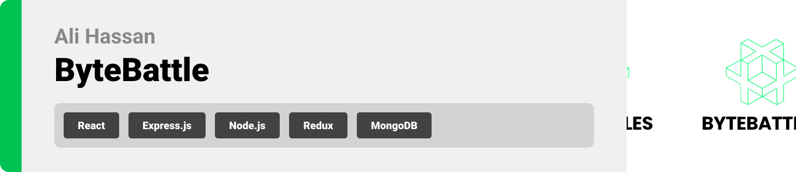

<br><br>

<!-- project philosophy -->


> An RPG game that teaches people how to program + companies can make a trial on it for entrance exams to be more interactive.
>
> "ByteBattles: The Coding Adventure" aims to revolutionize programming education by combining the excitement of an RPG game with the practicality of real-world coding challenges. Embark on a thrilling coding journey, level up your skills, and compete with others to become a coding champion!

### User Stories

- As a learner, I want to choose my coding path and progress through chapters to build my programming skills.
- As a coder, I want an AI mentor to guide me in real time, providing tips and challenges to enhance my learning.
- As a competitor, I want to engage in coding battles with fellow learners, testing my skills and speed.
- As a job seeker, I want to use the platform to prepare for coding interviews and showcase my skills to potential employers.
- As a recruiter, I want to create and publish coding challenges specific to my company’s needs so that I can identify and attract talented developers who have the skills we require.
- As a hiring manager, I want to access a dashboard where I can review candidates’ performances in coding challenges and their progress through courses, to evaluate their skills and suitability for our open positions.

<br><br>

<!-- Prototyping -->


> We designed "ByteBattles: The Coding Adventure" using wireframes and mockups, iterating on the design until we achieved the ideal layout for an immersive and educational gaming experience.

### Wireframes

| Chapter Selection                                               | AI Mentor Guidance                                                | Coding Battle Arena                                                 |
| --------------------------------------------------------------- | ----------------------------------------------------------------- | ------------------------------------------------------------------- |
|  |  |  |

### Mockups

| Home Screen                                      | Leaderboard                                      | Coding Challenge Result                                           |
| ------------------------------------------------ | ------------------------------------------------ | ----------------------------------------------------------------- |
|  |  |  |

<br><br>

<!-- Implementation -->


> Bringing the vision to life, we implemented "ByteBattles: The Coding Adventure" with the following features:

### Player Screens (Web)

| Dashboard                                    | Coding Arena                                       | Profile                                  |
| -------------------------------------------- | -------------------------------------------------- | ---------------------------------------- |
|  |  |  |

### Admin Screens (Web)

| Admin Dashboard                                          | Challenge Management                                               | User Analytics                                         |
| -------------------------------------------------------- | ------------------------------------------------------------------ | ------------------------------------------------------ |
|  |  |  |

<br><br>

<!-- Tech stack -->


### "ByteBattles: The Coding Adventure" is built using the following technologies:

- Frontend: [React](https://reactjs.org/), [Redux](https://redux.js.org/)
- Backend: [Node.js](https://nodejs.org/), [Express](https://expressjs.com/)
- Database: [MongoDB](https://www.mongodb.com/)
- Real-time Communication: [Socket.io](https://socket.io/)
- Authentication: [JWT](https://jwt.io/)
- Hosting: [Heroku](https://www.heroku.com/)

<br><br>

<!-- How to run -->


> To set up "ByteBattles: The Coding Adventure" locally, follow these steps:

### Prerequisites

Make sure you have the following installed:

- [Node.js](https://nodejs.org/)
- [MongoDB](https://www.mongodb.com/)

### Installation

1. Clone the repo
   ```sh
   git clone https://github.com/your_username_/ByteBattles-CodingAdventure.git
   ```
