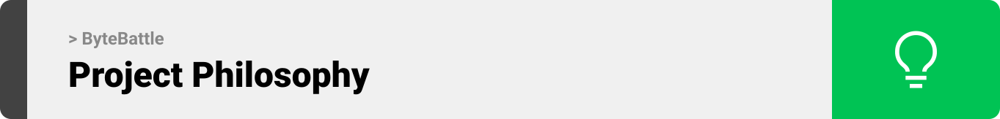

<br><br>

<!-- project philosophy -->


ByteBattle is an interactive web platform designed to revolutionize the way we learn programming. By integrating education with entertainment, it offers a unique learning experience where users can engage in courses enhanced with gaming elements using Phaser Library.

Our mission is to make programming accessible and enjoyable for everyone. ByteBattle allows users to learn HTML, CSS, Nodejs, and Python through courses and games, and to test their skills through challenges created by tech companies, fostering a practical understanding of programming concepts.

### User Stories
- As a user, I want to play educational games while learning programming, to enhance my learning experience.
- As a tech company, I want to create tests for potential hires, to evaluate their coding skills in a practical setting.
- As a user, I want to battle with AI in coding challenges, to test my skills and receive feedback.
- As a company user, I want to review the test results of candidates, to assess their coding skills and suitability for the job.
- As a user, I want to compete in timed coding challenges, to test my ability to write efficient code under pressure.
- As a company user, I want to customize tests with specific coding problems relevant to my industry, to find candidates with the right skill set.
- As a company user, I want to track the number of applicants and their performance, so I can gauge the interest and talent pool available.

<br><br>

<!-- Prototyping -->


ByteBattle was developed using a series of wireframes and mockups, focusing on user-friendly interfaces and interactive gaming experiences within the educational content.

### Wireframes and Mockups
Details and images of the wireframes and mockups can be inserted here

<br><br>

<!-- Implementation -->


ByteBattle is implemented with the following features:

### User Interfaces

| Course Screen | Game Screen (Drag-and-Drop) | Game Screen (Code Collection) | Test Screen | Leaderboard Screen |
| --- | --- | --- | --- | --- |
|  |  |  | *Test Screen placeholder* | *Leaderboard Screen placeholder* |


### Company Interfaces
| Test Creation Screen | Score Viewing Screen | Profile Management |
| --- | --- | --- |
*Insert appropriate screenshots or placeholders here*

<br><br>

<!-- Tech stack -->


ByteBattle is built using the following technologies:

- Frontend: React and Redux for responsive UI development.
- Backend: Node.js and ExpressJS for server-side logic.
- Database: MongoDB for data persistence.
- Gaming: Phaser Library for interactive game development.
- Additional Libraries: Multer for file uploads, various React libraries for UI components.

### Dependencies
*List of dependencies from your package.json file*

<br><br>

<!-- How to run -->


To set up ByteBattle locally, follow these steps:

### Prerequisites
*Instructions for prerequisites, such as Node.js and MongoDB setup*

### Installation

1. Clone the repo
   ```sh
   [git clone https://github.com/your_username_/ByteBattles-CodingAdventure.git](https://github.com/Ali-H-Hassan/ByteBattles-CodingAdventure.git)
   ```
2. Install NPM packages for both frontend and backend:
   ```sh
   npm install
   ```
3. Set up MongoDB and enter your database URI in config.js:
   ```js
   const MONGO_URI = 'ENTER YOUR MONGO URI';
   ```
4. Start the server:
   ```sh
   npm start
   ```

Now, you should be able to run ByteBattle locally and explore its features.
